<table width="100%">
  <tr>
    <td align="center" width="33%">
      
    </td>
    <td align="center" width="34%">
      
    </td>
    <td align="center" width="33%">
      
    </td>
  </tr>
</table>

### About Me

- Bachelor: Wuhan University of Technology
- Master: Shenzhen Institutes of Advanced Technology (SIAT), CAS
- Currently: National University of Singapore
- Research Fields: AI4Healthcare / Medical Imaging / MLLM 
- Interests: Computational Pathology, Virtual Staining, Medical Imaging, MLLM
- Email: xb1personal0mailbox@gmail.com

### GitHub Stats

<table width="100%">
  <tr>
    <td width="55%" valign="top">
      
    </td>
    <td width="45%" valign="top">
      
    </td>
  </tr>
</table>

### Featured Work

<table width="100%">
  <tr>
  <td width="33%" valign="top">
      
    </td>
    <td width="34%" valign="top">
      
    </td>
    <td width="33%" valign="top">
      
    </td>
    
  </tr>
</table>

### Tech Stack

  

<table width="100%">
  <tr>
    <td align="center"></td>
    <td align="center"></td>
    <td align="center"></td>
    <td align="center"></td>
    <td align="center"></td>
    <td align="center"></td>
  </tr>
</table>

### Contribution Snake

---

<table width="100%">
  <tr>
    <td align="center">
      <b>Feel free to reach out for research discussion & collaboration.</b> 
      <a href="https://github.com/DianaNerualNetwork">github.com/DianaNerualNetwork</a>
      ·
      <a href="mailto:xb1personal0mailbox@gmail.com">xb1personal0mailbox@gmail.com</a>
    </td>
  </tr>
</table>

